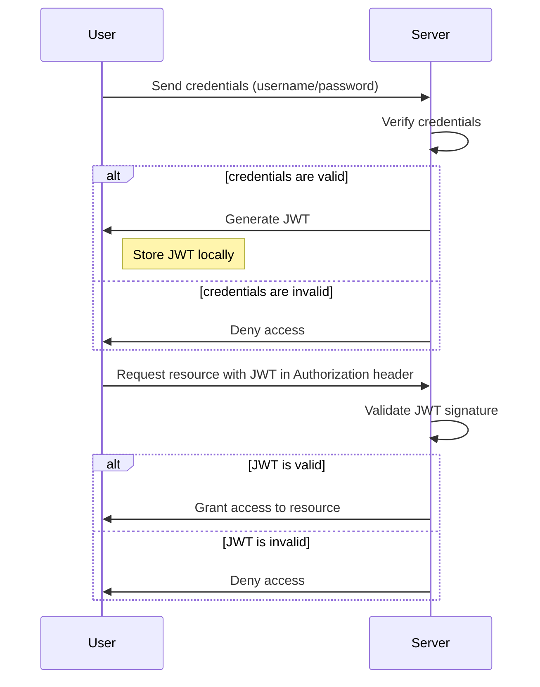
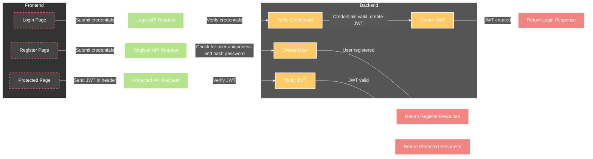
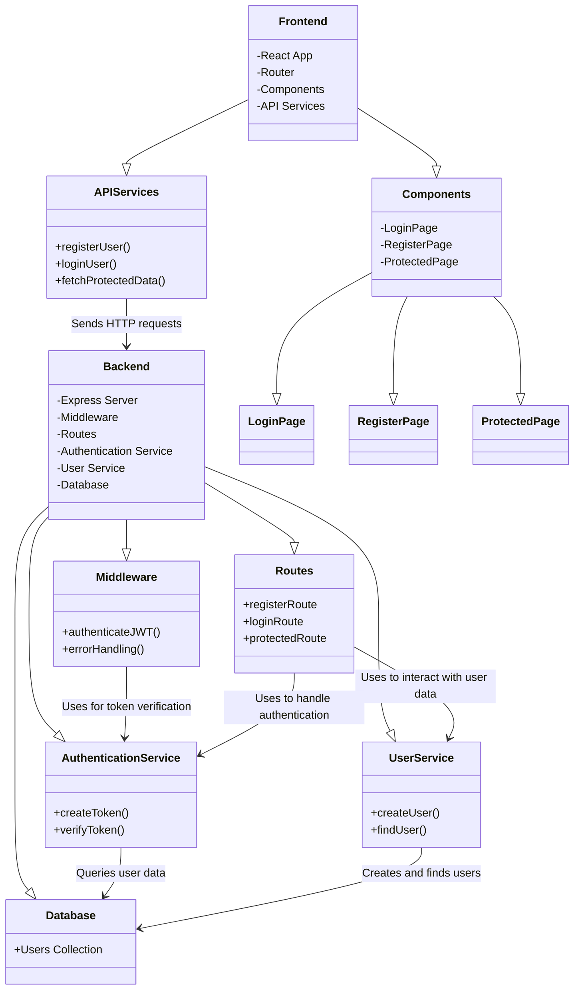
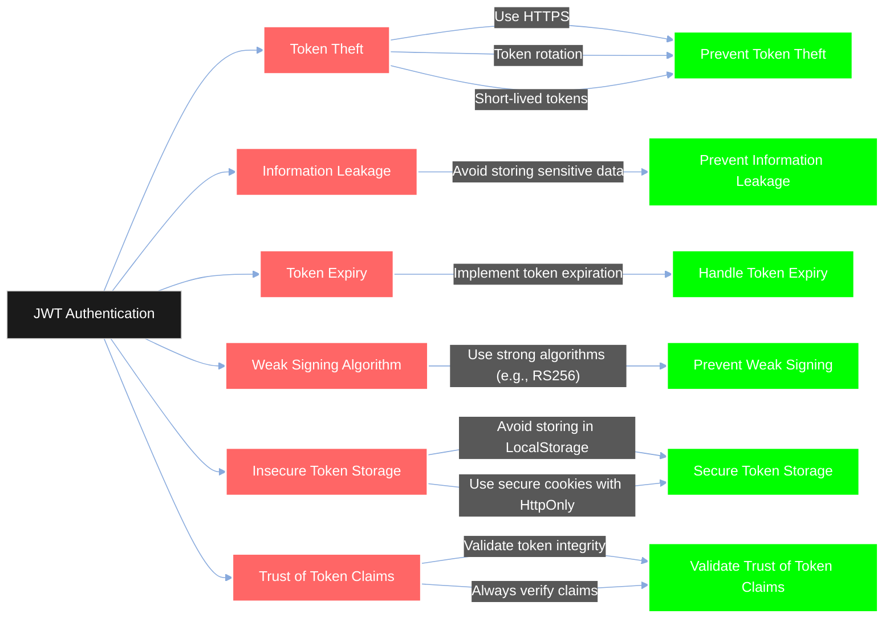
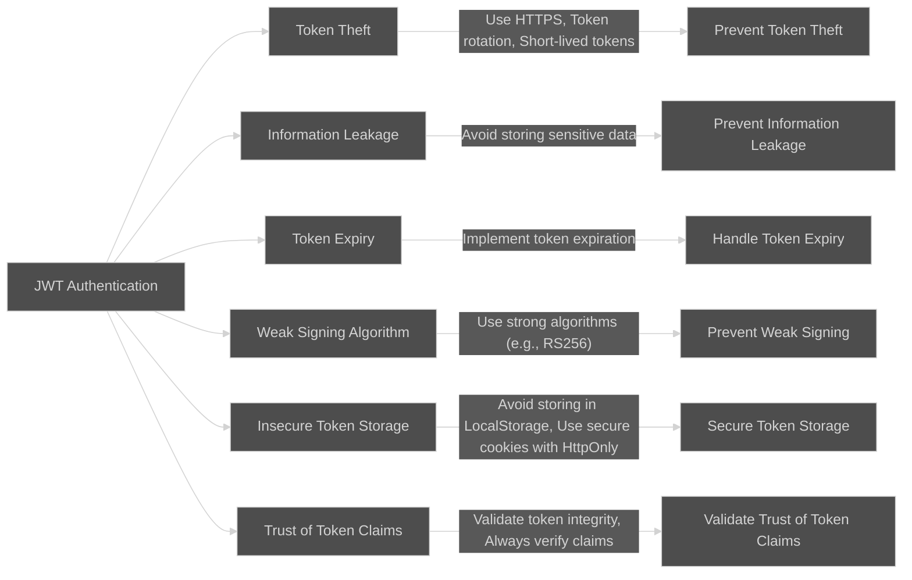

# JWT-Authentication

Folder structure

my-app/
|-- backend/
|   |-- node_modules/
|   |-- .env
|   |-- package.json
|   |-- package-lock.json
|   |-- server.js
|
|-- frontend/
|   |-- node_modules/
|   |-- public/
|   |   |-- index.html
|   |   |-- favicon.ico
|   |-- src/
|   |   |-- components/
|   |   |   |-- App.js
|   |   |   |-- Login.js
|   |   |   |-- Register.js
|   |   |   |-- Protected.js
|   |   |-- index.js
|   |   |-- index.css
|   |-- package.json
|   |-- package-lock.json
|
|-- .gitignore

